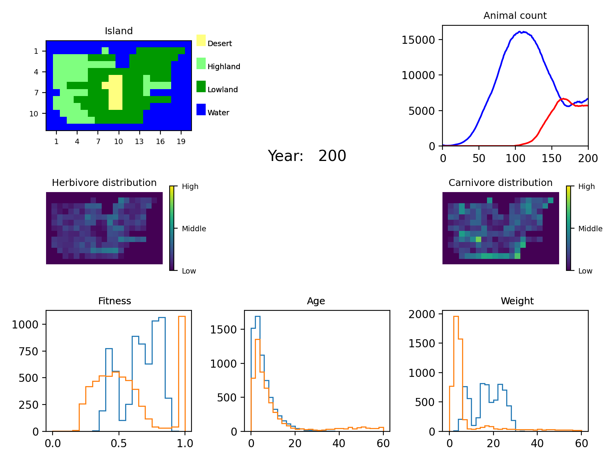

.. BioSim documentation master file, created by
   sphinx-quickstart on Thu Jan 14 12:49:27 2021.
   You can adapt this file completely to your liking, but it should at least
   contain the root `toctree` directive.

Welcome to BioSim's documentation!
==================================

This is a simple simulation of
   * an island
   * with cells
   * containing a population herbivores and carnivores.

This is an example of how the simulation can look like:

.. toctree::
   :maxdepth: 2
   :caption: Contents:

   animals
   landscape
   island
   simulation

Indices and tables
==================

* :ref:`genindex`
* :ref:`modindex`
* :ref:`search`
